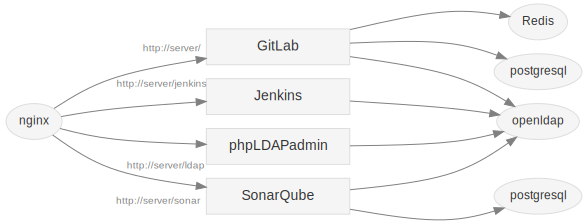

PoCCi
=====

A try of CI Services by Docker containers.



[日本語](./README.ja.md)

Requirement
-----------
*   [Docker](https://www.docker.com/)
*   [Docker Compose](https://github.com/docker/fig/)

Usage
-----
1.  Clone this repository.

2.  Create `config` directory from template by `bin/generate-config-from-template`.

    ```bash
    cd bin
    chmod +x *
    bash ./generate-config-from-template
    ```

3.  Check and edit the files in `config` directory.

    ```
    config/
      - docker-compose.yml ... Service composition (Docker Compose file)
      - jenkins-slaves.yml ... Jenkins slave nodes (Docker Compose file)
      - setup.yml          ... User settings
    ```

4.  Create and start services by `bin/create-service`

    ```bash
    cd bin
    bash ./create-service
    ```

5.  Use the services.

    *   http://localhost/ ... GitLab / ALMinium (Redmine)
    *   http://localhost/jenkins ... Jenkins
    *   http://localhost/sonar ... SonarQube
    *   http://localhost/ldap ... phpLDAPadmin

Users
--------------
### Administrator
Service      | User name                  | Password
------------ | -------------------------- | --------
GitLab       | root                       | 5iveL!fe
ALMinium     | admin                      | admin
SonarQube    | admin                      | admin
phpLDAPadmin | cn=admin,dc=example,dc=com | admin

### Developer
User name  | Password
---------- | --------
jenkinsci  | password
bouze      | password
