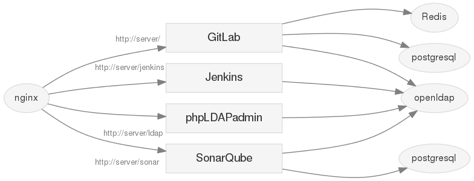

PoCCi
=====

A try of CI Services by Docker containers.



[日本語](./README.ja.md)

Requirement
-----------
*   [Docker](https://www.docker.com/)
*   [Docker Compose](https://github.com/docker/compose/)

Usage
-----
1.  Clone this repository.

    ```bash
    git clone https://github.com/ototadana/pocci.git pocci
    cd pocci
    ```

2.  Build setup tools.

    ```bash
    cd bin
    bash ./build
    ```

3.  Create `config` directory from template by `generate-config-from-template`.

    ```bash
    ./generate-config-from-template
    ```

4.  Check and edit the files in `config` directory.

    ```
    config/
      - code/               ... Example codes
      - nginx/              ... Nginx reverse proxy configuration
      - docker-compose.yml  ... Service composition (Docker Compose file)
      - jenkins-slaves.yml  ... Jenkins slave nodes (Docker Compose file)
      - setup.yml           ... User settings
    ```

5.  Create and start services by `create-service`.

    ```bash
    ./create-service
    ```

6.  Apply user settings (`setup.yml`) by `apply-user-settings`.

    ```bash
    ./apply-user-settings
    ```

7.  Use the services.

    *   http://localhost/ ... GitLab / ALMinium (Redmine)
    *   http://localhost/jenkins ... Jenkins
    *   http://localhost/sonar ... SonarQube
    *   http://localhost/ldap ... phpLDAPadmin

Users
--------------
### Administrator
Service      | User name                  | Password
------------ | -------------------------- | --------
GitLab       | root                       | 5iveL!fe
ALMinium     | admin                      | admin
SonarQube    | admin                      | admin
phpLDAPadmin | cn=admin,dc=example,dc=com | admin

### Developer
User name  | Password
---------- | --------
jenkinsci  | password
bouze      | password
